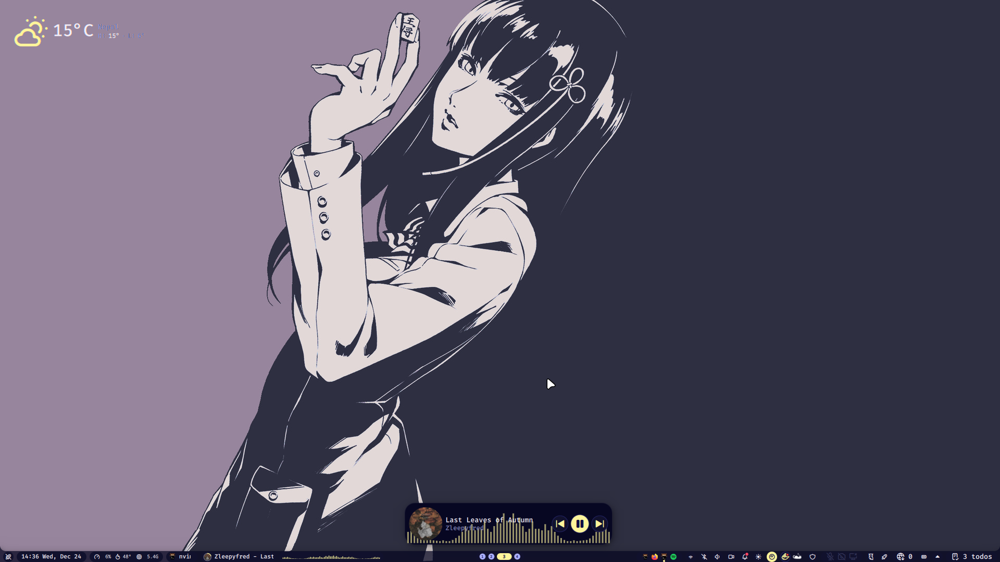
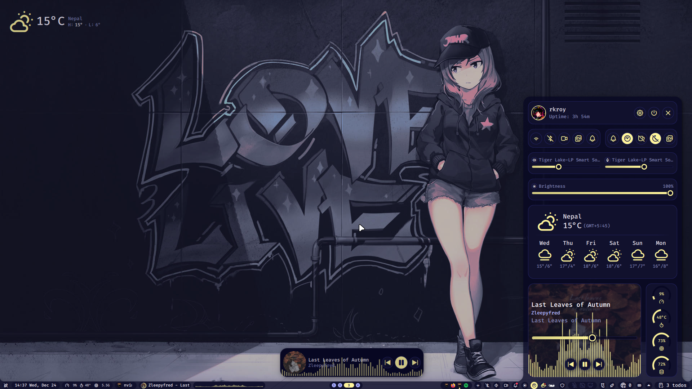
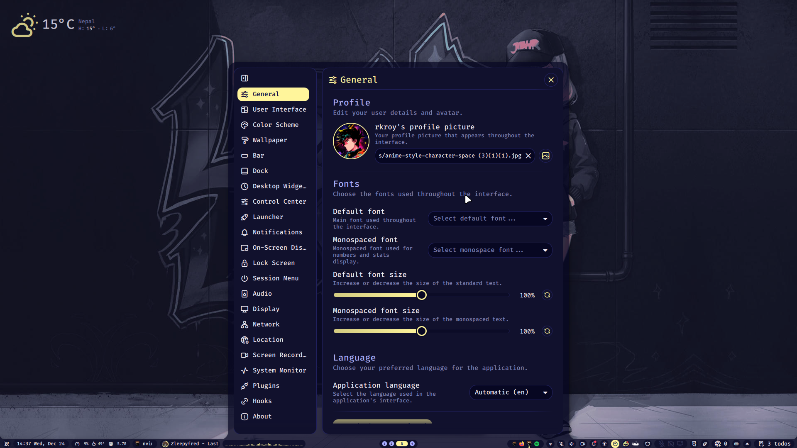
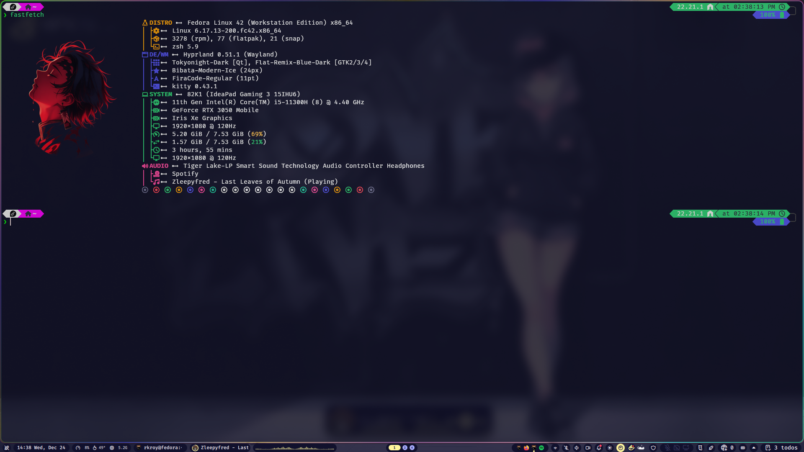
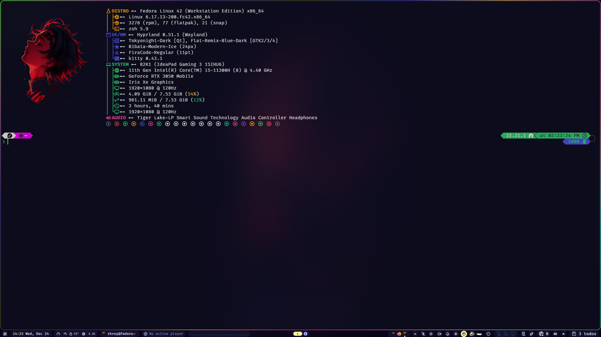
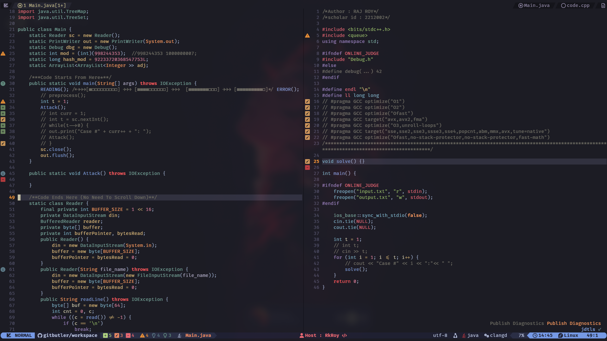
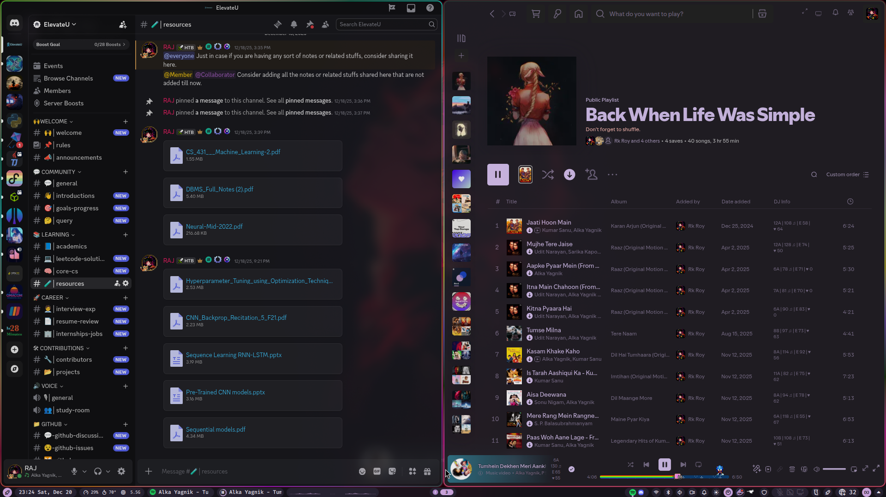
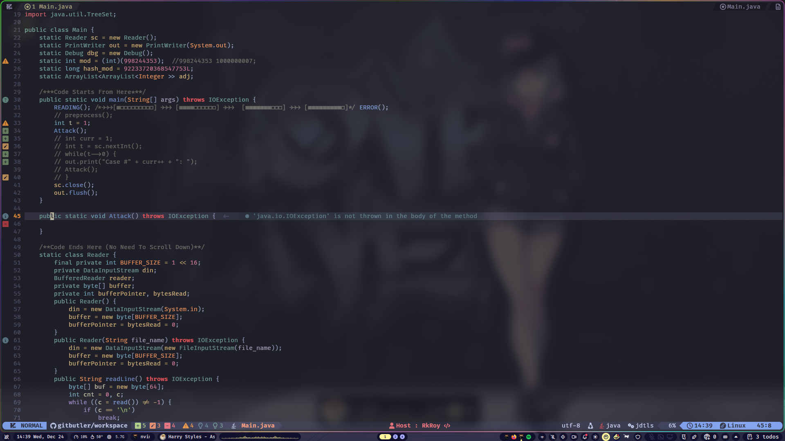
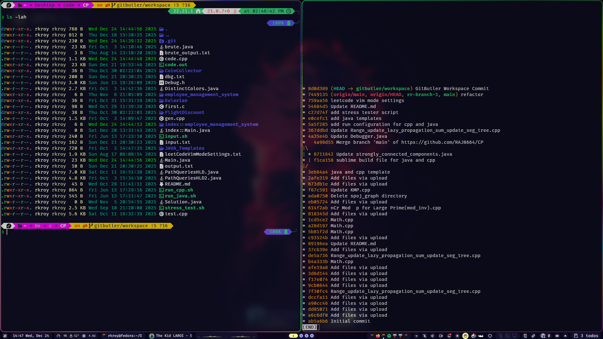
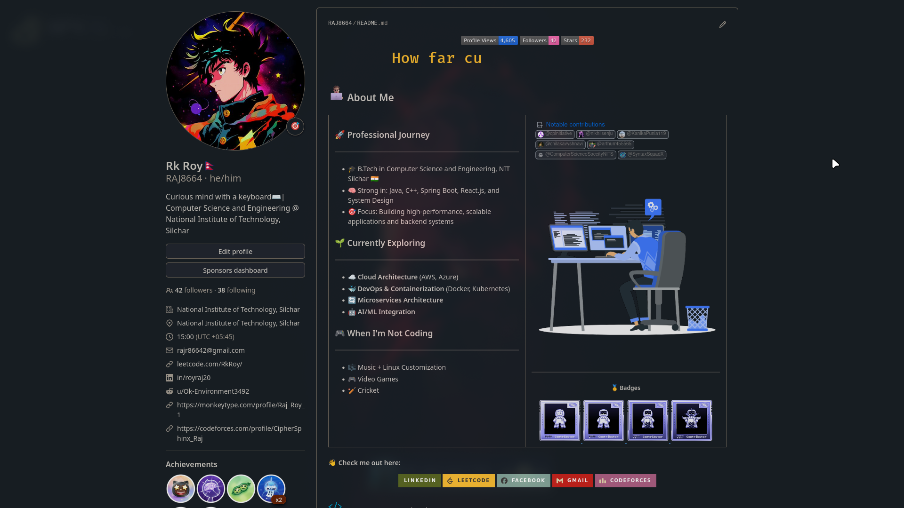

⚙️ Welcome to the chaos I call my Linux dotfiles.

## 📸 Screenshots

  

## Future Plans

- **Minimization:** Continuously refine and minimize the dotfiles for better readability and easier management.
- **Automated Installation:** Develop scripts to automate the installation and setup process across different Linux systems.
